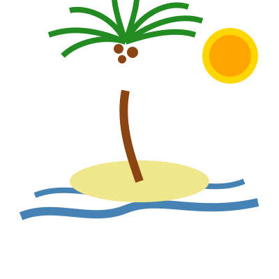
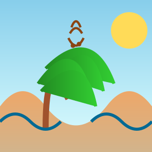
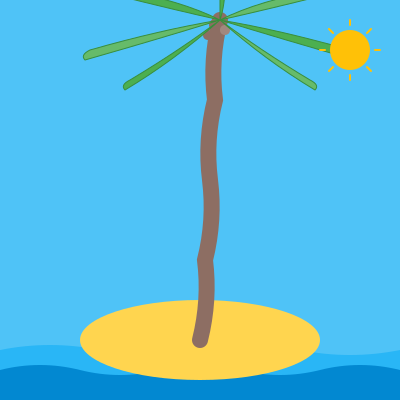
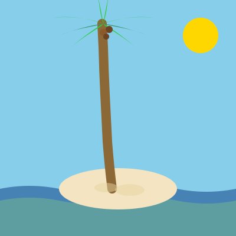
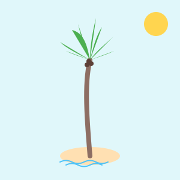
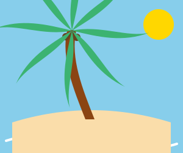

+++
title = 'Palm Eval'
date = 2025-06-18
draft = true
tags = ['llm']
+++

Born and raised in Los Angeles and with a last name of "Palmer", you can probably guess my favorite tree. Ever since creating
this site, I've wanted some sort of palm tree drawing or animation to use on the homepage or as a logo. But even as the models progressed,
I still don't have anything acceptable. Maybe if I spent enough time fine-tuning my prompt, I could get something passable,
but I haven't found the magic recipe yet.

Simon Willison has been tracking how well LLMs can draw [Pelicans on a bicycle](https://simonwillison.net/2024/Oct/25/pelicans-on-a-bicycle/).
This is my version. Forget the animation, lets see how well it can draw one.

I tried two prompts, one simple and one more detaild across ChatGPT, Claude and Gemini. Judge for yourself.

## Simple Prompt
The Prompt:
> Generate an SVG of a palm tree



[//]: # (Sonnet 3.7)

[//]: # ()
[//]: # (![Sonnet 3.7 Simple Palm Tree]&#40;simple-pt-claude-sonnet-3.7.svg&#41;)

[//]: # ()
[//]: # (Opus 3)

[//]: # ()
[//]: # (![Opus 3 Simple Palm Tree]&#40;simple-pt-claude-opus-3.svg&#41;)



[//]: # (Sonnet 4)

[//]: # ()
[//]: # (![Sonnet 4 Simple Palm Tree]&#40;simple-pt-claude-sonnet-4.svg&#41;)

[//]: # ()
[//]: # ()
[//]: # (Opus 4)

[//]: # ()
[//]: # (![Opus 4 Simple Palm Tree]&#40;simple-pt-claude-opus-4.svg&#41;)



[//]: # (### GPT)

[//]: # ()
[//]: # (ChatGPT-4o)

[//]: # ()
[//]: # (![4o Simple Palm Tree]&#40;simple-pt-gpt-4o.svg&#41;)

[//]: # ()
[//]: # (### Gemini)

[//]: # ()
[//]: # (![Gemini 2.5 Pro Simple Palm Tree]&#40;simple-pt-gemini-2.5-pro.svg&#41;)

---

## Detailed Prompt
The Prompt:
> Generate an SVG of a tall, curved palm tree on a small sandy island.
The tree should have a slightly bent trunk, around 6–8 large fronds, and a few coconuts visible under the leaves.
Include a simple sun in the top right corner and two short waves at the base of the island to suggest the ocean.
Use smooth curves and avoid overly realistic shading — aim for a clean, stylized, vector illustration suitable for icons or mobile design.

### Claude
Sonnet 3.7

Opus 3

Sonnet 4

Opus 4

### GPT

ChatGPT-4o

### Gemini

